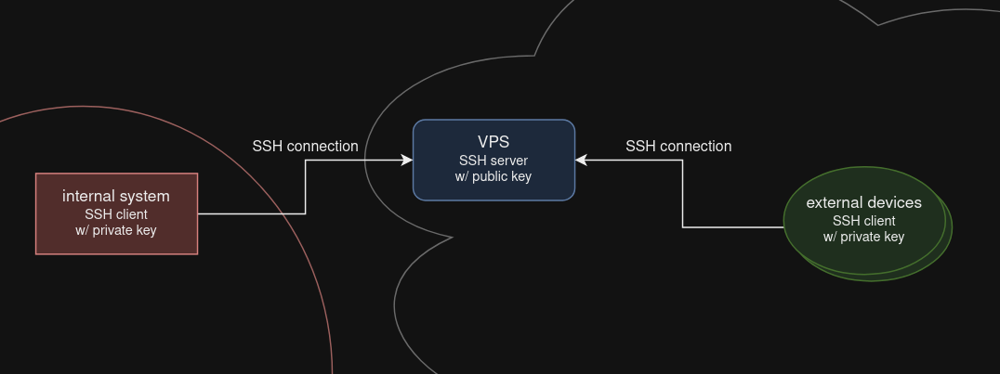

# SSH Reverse Tunneling internal Services through NAT/Firewalls

Local or internal services can be exposed via SSH reverse tunneling while bypassing NAT or firewalls.



## Features
- relay internal services through NAT/firewall using a relay/rendevouz server
- expose internal services of a restricted network in a secure manner
- manage internal systems or exfiltrate data
- no need to install extra software, merely for convenience
- no need to open ports on either end, the only port open is the relay's SSH server
- no credentials stored on relay

## Prerequisites
- configurable VPS or root server
- SSH client on server and clients
  - optionally autossh
- outgoing SSH connections to VPS
  - see [Extensions](#extensions-and-alternatives) for ways to circumvent firewalls

## Concept
VPS acts as a relay:
1. the internal system (server) stays connected to the VPS and forwards a specified local or network reachable service
2. external systems (clients) can connect anytime to the VPS and forward a local port of the VPS to themselves
3. eventually the user can connect locally on its client to use services from a remote network


## Basic Setup
1. on VPS (relay)
	1. set up a relayuser with SSH public key
2. on internal system (server)
	1. configure SSH with private key of relayuser
	2. optionally set up autossh for persistence
	3. configure port forward to VPS (localhost)
3. on external systems (client)
	1. configure SSH with private key of relayuser
	2. configure port forward from VPS to client

Keep in mind to first connect all SSH connections manually for verifying and approving the VPS' fingerprint. Also check if the forwarded port on the VPS is exclusively bound to localhost.


## Detailled Setup with Commands
As an example a local web service on the server will be forwarded.

### VPS
1. create new user relayuser
    * `sudo useradd -m relayuser`
2. generate a key pair on a secure device, transfer the public key to the VPS, transfer the private key to the server and clients
    * `ssh-keygen -t ed25519 -C "relayuser"`
    * use ssh-copy-id or scp
3. harden the relay, e.g. disable SSH password authentication via sshd_config, restart SSH server
    * `PasswordAuthentication no`
    * `sudo systemctl restart ssh`

### Server
1. establish SSH tunnel (port 44433 is local target port on VPS)
    * `ssh -fN -R 44433:localhost:443 -i ~/.ssh/id_ed25519_relay relayuser@VPS`
2. automation with autossh and new systemd service
    * `ExecStart=/usr/bin/autossh -NT -o "ExitOnForwardFailure=yes" -R 44433:127.0.0.1:443 -i /home/user/.ssh/id_ed25519_relay relayuser@VPS`

### Client
1. establish SSH tunnel for web access, connect via https://localhost:44433
    * `ssh -L 44433:localhost:44433 VPS sleep 86400`
2. for SSH access you can use the following
    * `ssh -f -L 40022:localhost:40022 VPS sleep 10; ssh user@localhost -p 40022`
3. automation see Server
4. client ssh config
```
Host VPS
  Hostname domain.of.vps
  User relayuser
  IdentityFile ~/.ssh/id_ed25519_relay
```
5. optionally define alias
    * `alias relayweb='echo "[*] Access via https://localhost:44433 quit with Ctrl+c" && ssh -L 44433:localhost:44433 -i ~/.ssh/id_ed25519_relay VPS sleep 86400'`

## Extensions and Alternatives
* if TCP/22 outbound is blocked, try to start SSH server on relay on port 80/443/25/587/...
  * alternatively try to use SSH through proxies via HTTP CONNECT or by wrapping SSH in HTTP(S) [1]
* for a bit more VPN feeling, set up the server SSH tunnel as dynamic (`ssh -D 1080 user@server`)
  * so each SOCKS-aware application on client devices can connect to arbitrary internal services without being limiting to specific ports
  * even non-SOCKS-aware applications could use this with e.g. tun-socks/sockstun
* Tailscale is based on wireguard and also uses a central signaling server


[1] https://unix.stackexchange.com/a/190612
